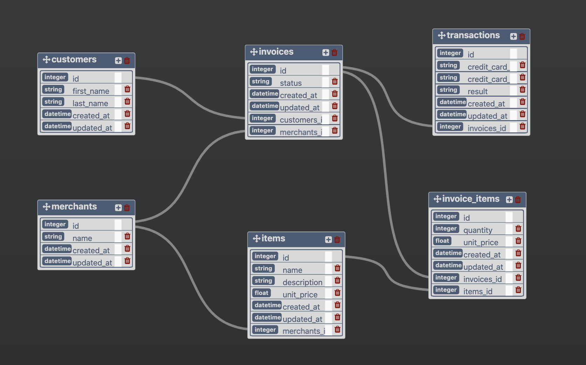

# Rails Engine

Rails Engine is an API for viewing and interacting with the database of a fictitious E-Commerce Application. This was a solo project completed as part of the Back End Software Engineering curriculum at the Turing School of Software & Design.

The deployed project can be found on Heroku at https://sales-engine-m3.herokuapp.com

example query: https://sales-engine-m3.herokuapp.com/api/v1/items/5

example response:
```
{
  "data": {
    "id": "5",
    "type": "item",
    "attributes": {
      "name": "Item Expedita Aliquam",
      "description": "Voluptate aut labore qui illum tempore eius. Corrupti cum et rerum. Enim illum labore voluptatem dicta consequatur. Consequatur sunt consequuntur ut officiis.",
      "unit_price": 687.23,
      "merchant_id": 1
    }
  }
}
```
Database schema:

* * *
## Available Endpoints:

### Merchant Information

**GET** /api/v1/merchants

Description: Get the primary data of all merchants

Accepted Parameters:

| name | data type | description | optional/required |
| --- | --- | --- | --- |
| per_page | integer | the number of resources to return per page; defaults to 20 | optional |
| page | integer | which page to query | optional |

___
**GET** /api/v1/merchants/:id

Description: Get details about a single merchant by id

___
**GET** /api/v1/merchants/find

Description: Search for a single merchant by name

Accepted Parameters:

| name | data type | description | optional/required |
| --- | --- | --- | --- |
| name | string | case-insensitive search term; includes partial matches | optional |

___
**GET** /api/v1/merchants/find_all

Description: Search for all merchants with names matching a search term

Accepted Parameters:

| name | data type | description | optional/required |
| --- | --- | --- | --- |
| name | string | case-insensitive search term; includes partial matches | optional |

___
**GET** /api/v1/merchants/:merchant_id/items

Description: Get all items associated with a merchant

* * *

### Item Information

**GET** /api/v1/items

Description: Get the primary data of all items

Accepted Parameters:

| name | data type | description | optional/required |
| --- | --- | --- | --- |
| per_page | integer | the number of resources to return per page; defaults to 20 | optional |
| page | integer | which page to query | optional |

___
**GET** /api/v1/items/:id

Description: Get details about a single item by id

___
**GET** /api/v1/items/find

Description: Search for a single item by name or price; price queries can include min\_price and/or max\_price, but cannot be combined with a name query

Accepted Parameters:

| name | data type | description | optional/required |
| --- | --- | --- | --- |
| name | string | case-insensitive search term; includes partial matches | optional |
| min_price | float | minimum price; returns items with prices greater than or equal to the specified amount | optional |
| max_price | float | maximum price; returns items with prices less or equal to the specified amount | optional |

___
**GET** /api/v1/items/find_all

Description: Search for multiple items by name or price; price queries can include min\_price and/or max\_price, but cannot be combined with a name query

Accepted Parameters:

| name | data type | description | optional/required |
| --- | --- | --- | --- |
| name | string | case-insensitive search term; includes partial matches | optional |
| min_price | float | minimum price; returns items with prices greater than or equal to the specified amount | optional |
| max_price | float | maximum price; returns items with prices less or equal to the specified amount | optional |

___
**POST** /api/v1/items

Description: Create an item; name, description, unit price, and merchant id are required.

___
**PUT** /api/v1/items/:id

Description: Update an item

___
**DELETE** /api/v1/items/:id

Description: Delete an item

___
**GET** /api/v1/items/:item_id/merchant

Description: Get the merchant associated with an item

* * *

### Business Analysis

**GET** /api/v1/revenue/merchants

Description: Find a specified number of merchants ranked by total revenue in descending order

Accepted Parameters:

| name | data type | description | optional/required |
| --- | --- | --- | --- |
| quantity | integer | the number of results to be returned | optional |

___
**GET** /api/v1/merchants/most_items

Description: Find a specified number of merchants ranked by total number of items sold in descending order

Accepted Parameters:

| name | data type | description | optional/required |
| --- | --- | --- | --- |
| quantity | integer | the number of results to be returned | optional |

___
**GET** /api/v1/revenue/merchants/:id

Description: Get the total revenue for a given merchant

___
**GET** /api/v1/revenue/items

Description: Find a specified quantity of items ranked by descending revenue

Accepted Parameters:

| name | data type | description | optional/required |
| --- | --- | --- | --- |
| quantity | integer | the number of results to be returned | optional |

___
**GET** /api/v1/revenue/unshipped

Description: Find the potential revenue of unshipped orders

Accepted Parameters:

| name | data type | description | optional/required |
| --- | --- | --- | --- |
| quantity | integer | the number of results to be returned; defaults to 10 if not specified | optional |

___
**GET** /api/v1/revenue

Description: Find the total revenue across all merchants between the given dates, inclusive of the start and end date

Accepted Parameters:

| name | data type | description | optional/required |
| --- | --- | --- | --- |
| start | string | the first date for which revenue should be included; must be formatted 'YYYY-MM-DD' | required |
| end | string | the first date for which revenue should be included; must be formatted 'YYYY-MM-DD' | optional |

___
**GET** /api/v1/revenue/weekly

Description: Report of all revenue sorted by week; dates represent the first day of each week
